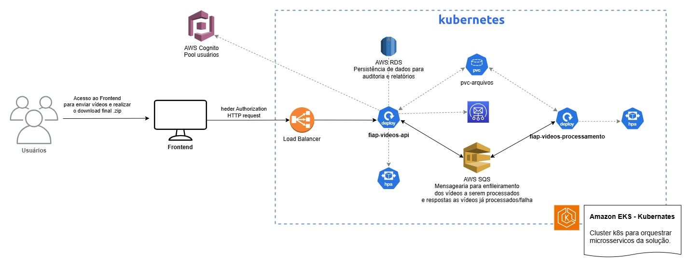
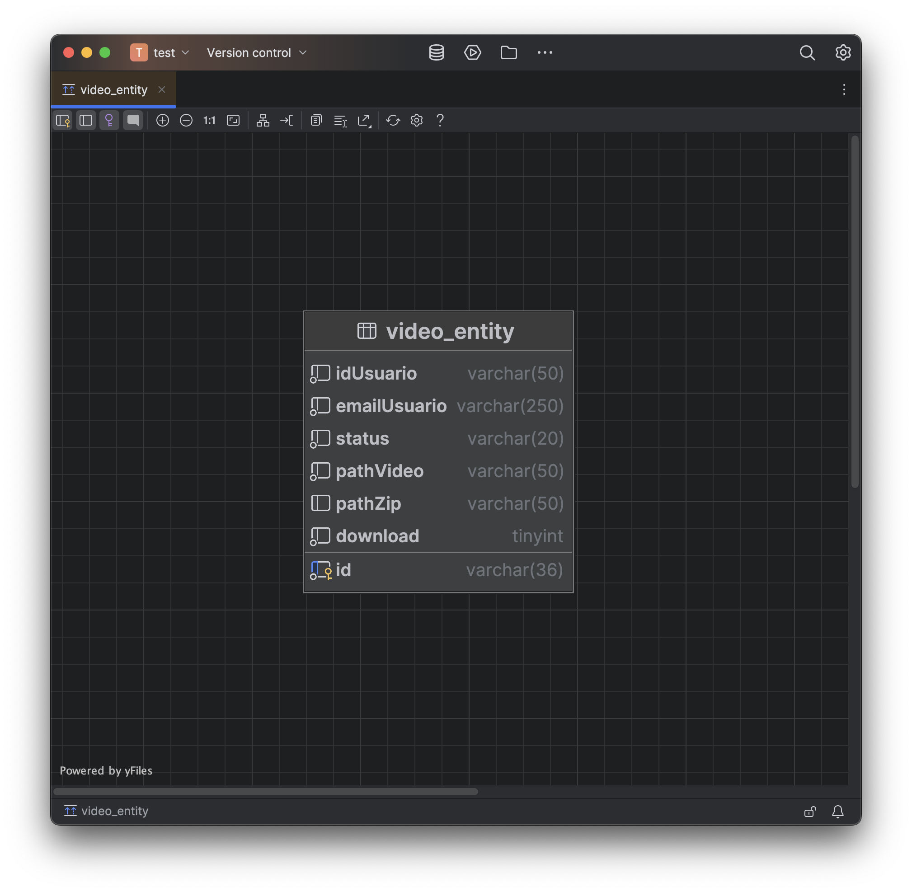

# Documentação Hackathon

## O problema
Durante o hackathon da fase 5 da FIAP, nos foi apresentado um serviço com a mesma finalidade que necessitava aplicar alguns conceitos de arquitetura que conhecemos ao longo do curso. Era necessário resolver alguns requisitos técnicos que nos foram solicitados.

## Solução
Utilizando os conhecimentos da primeira fase, foi montado um event-storm e que permitiu desenvolver o diagrama de arquitetura. Com esse diagrama finalizado foi possível tomar as decisões técnicas com maior facilidade.

||
|:-:|
| *Imagem 1. EventStorm elaborado.* |

||
|:-:|
| *Imagem 2. Diagrama de arquitetura finalizado.* |

Optamos pela criação de 2 microsserviços utilizando a arquitetura hexagonal, sendo eles uma API gerencial em Node e um serviço em Java. Preferimos a hexagonal por conta de ser menos verbosa para o nivel de complexidade necessária para o projeto.

## fiap-video-processamento
Para o serviço de processamento de vídeos, escolhemos utilizar o Java com o framework Quarkus e a biblioteca FFmpeg. O Quarkus foi selecionado por sua capacidade de fornecer um ambiente de desenvolvimento rápido e eficiente, além de ser otimizado para execução em contêineres, o que se alinha com nossa estratégia de utilizar Kubernetes para orquestração. A biblioteca FFmpeg foi escolhida por sua robustez e ampla utilização na manipulação e processamento de arquivos de mídia, permitindo realizar operações como conversão de formatos, extração de frames e aplicação de filtros de forma eficiente.

||
|:-:|
| *Imagem 3. Logs do serviço executando na AWS.* |

||
|:-:|
| *Imagem 4. Cobertura de testes do serviço de processamento.* |

||
|:-:|
| *Imagem 5. Análise do código do serviço de processamento.* |

## fiap-video-api

Para o serviço de API, escolhemos utilizar o NestJS, um framework Node.js que permite a construção de aplicações escaláveis e de fácil manutenção. O NestJS foi selecionado por sua arquitetura modular e suporte a TypeScript, o que facilita a organização do código e a implementação de funcionalidades complexas. Além disso, o NestJS possui uma integração nativa com diversas bibliotecas e ferramentas, como o TypeORM para gerenciamento de banco de dados e o Swagger para documentação de APIs, agilizando o desenvolvimento.

||
|:-:|
| *Imagem 6. Logs da api executando na AWS.* |

||
|:-:|
| *Imagem 7. Cobertura de testes do serviço de API.* |

## CI/CD
Ao versionar o código no github, temos acesso a actions para deixar as pipilines CI/CD totalmente seguras e automáticas

||
|:-:|
| *Imagem 8. Workflow configurado no repositório* |

## Database
Observando a necessidade especifica do desafio, optamos em utilizar apenas o SGBD relacional. Uma tabela principal com data de inicio e fim do processamento, id, usuário, nome do arquivo processado e nome do arquivo zip gerado. Outra tabela com as etapas desse processamento, para conseguir entender o status do processamento. O banco de dados selecionado foi o MySQL, hospedado no Amazon RDS, com o objetivo de reduzir custos operacionais e garantir alta disponibilidade.

||
|:-:|
| *Imagem 9. Tabela no Mysql* |

## Mensageria
Para garantir a comunicação assíncrona entre os microsserviços, utilizamos o Amazon SQS como broker de mensagens. Essa escolha se deu pela sua robustez e facilidade de integração com diferentes linguagens de programação. Implementamos filas para gerenciar as mensagens de eventos e comandos, assegurando a escalabilidade e a resiliência do sistema.

## Autenticação e Autorização
Para gerenciar a autenticação e autorização dos usuários, utilizamos o Amazon Cognito. Essa escolha foi motivada pela facilidade de integração com outras soluções da AWS e pela capacidade de escalar conforme a demanda do projeto.

## Termo de Aceite LGPD
Para garantir a conformidade com a Lei Geral de Proteção de Dados (LGPD), deverá ser implementado um termo de aceito que deve ser lido e aceito por todos os usuários antes de utilizarem nossos serviços. Esse termo detalha como os dados pessoais serão coletados, armazenados, utilizados e protegidos, assegurando a transparência e o consentimento informado dos usuários.

## Kubernetes
Para orquestrar os microsserviços, utilizamos o Kubernetes (K8s). Essa escolha foi motivada pela necessidade de gerenciar a escalabilidade, a resiliência e a disponibilidade dos serviços de forma eficiente. Com o Kubernetes, conseguimos automatizar a implantação, o dimensionamento e a operação dos contêineres, garantindo que nossos microsserviços estejam sempre disponíveis e funcionando corretamente. Utilizamos o Amazon EKS (Elastic Kubernetes Service) para facilitar a integração com outros serviços da AWS e simplificar a gestão do cluster Kubernetes.

## Links

[Codecov - Api Gerenciamento](https://app.codecov.io/gh/Fiap-Video-API/fiap-video-api/)  
[Codecov - Serviço Processamento](https://app.codecov.io/gh/Fiap-Video-API/fiap-video-processamento)

## Quem somos
- Lucas Leal - RM355575 - leallucasfonseca@gmail.com
- Merhy Omar Daychoum - RM356180 - merhydaychoum@gmail.com
- Wanderson Pereira - RM356410 - wanderson.p.ayres@gmail.com
- Jackson Carbonera - RM354963 - jwccarbonera@outlook.com
